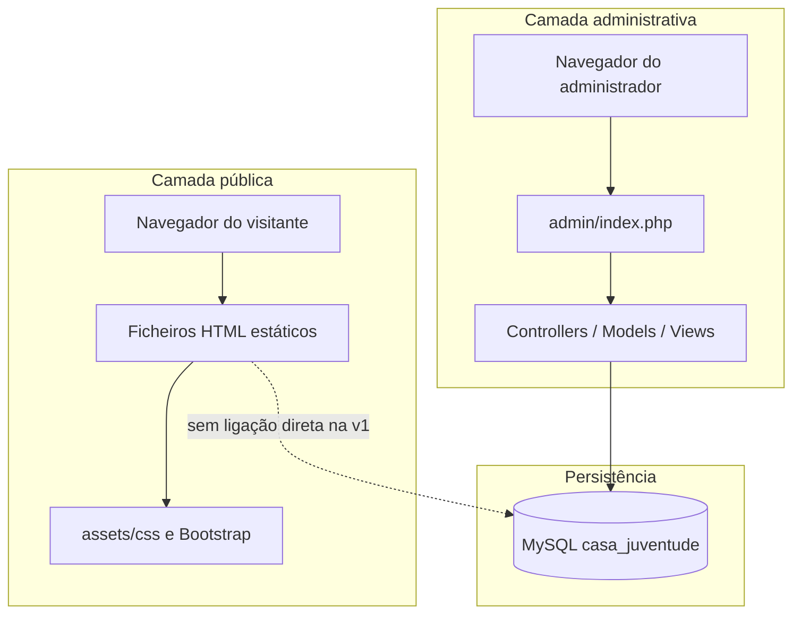

# Casa da Juventude Center

[](LICENSE)
[](https://www.php.net/)
[](https://www.mysql.com/)
[](index.html)
[](admin/README.md)

---

## Resumo executivo

O **Casa da Juventude Center** é uma solução web composta por dois componentes complementares: um **site institucional estático**, voltado para a divulgação pública da organização, e uma **área de administração** desenvolvida em PHP vanilla, destinada à gestão operacional de alunos, cursos, corpo docente, funcionários e inscrições.

O projeto responde à necessidade de centralizar a informação educativa e social do centro num canal acessível à comunidade, enquanto disponibiliza à equipa interna ferramentas seguras para manter os dados atualizados sem depender de frameworks externos ou infraestrutura complexa.

---

## Problema que o projeto resolve

Instituições de formação juvenil frequentemente dependem de conteúdo disperso (folhetos, redes sociais, listagens manuais) para comunicar cursos e atividades, o que dificulta a consistência da informação e aumenta o esforço administrativo. Este repositório aborda dois pontos:

| Desafio | Abordagem no projeto |
|--------|----------------------|
| Visibilidade pública limitada | Site informativo com história, cursos, atividades, projetos e serviços |
| Gestão manual de inscrições e cadastros | Painel administrativo com CRUD completo e base de dados relacional |
| Risco de exposição de dados sensíveis | Autenticação, controlo de acesso, validação server-side e práticas alinhadas com OWASP Top 10 |

O site público permanece independente da base de dados na versão atual, garantindo simplicidade de alojamento e estabilidade da interface visitante. A área `admin/` constitui a fonte de verdade dos dados operacionais.

---

## Funcionalidades principais

### Site público (front-end estático)

- Página inicial com apresentação institucional e carrossel de imagens
- Página de história e missão da organização
- Catálogo de cursos com duração, preços, períodos e horários
- Listagem de atividades, projetos e serviços
- Interface responsiva com folhas de estilo dedicadas (`assets/css/`)

### Área de administração (`admin/`)

- Autenticação de administradores com sessão segura e limitação de tentativas de login
- Dashboard com indicadores agregados e inscrições recentes
- CRUD completo para: **alunos**, **cursos**, **professores**, **funcionários** e **inscrições**
- Pesquisa e paginação nas listagens
- Proteção CSRF, prepared statements (PDO) e escape de saída HTML
- Seed inicial dos nove cursos alinhados com o conteúdo público de `cursos.html`

Documentação técnica detalhada do painel: [admin/README.md](admin/README.md).

---

## Arquitetura do sistema



**Fluxo resumido**

1. O visitante acede diretamente aos ficheiros HTML servidos pelo servidor web.
2. O administrador acede a `admin/`, autentica-se e opera sobre a base de dados via PHP e PDO.
3. Na versão atual, o conteúdo público dos cursos não é gerado dinamicamente a partir da base de dados; a sincronização é responsabilidade editorial ou evolução futura do projeto.

---

## Estrutura do projeto

```
casa-da-juventude-center/
├── index.html              # Página inicial
├── historia.html           # História e missão
├── cursos.html             # Catálogo público de cursos
├── atividades.html         # Atividades
├── projetos.html           # Projetos (em desenvolvimento)
├── servicos.html           # Serviços (em desenvolvimento)
├── assets/                 # Recursos do site público
│   ├── css/                # style.css, bootstrap.min.css
│   ├── js/                 # bootstrap.bundle.min.js
│   └── images/             # Banners e imagens
├── admin/                  # Aplicação PHP de administração
│   ├── index.php           # Front controller
│   ├── bootstrap.php       # Autoload, sessão, variáveis de ambiente
│   ├── config/             # Configuração da aplicação e base de dados
│   ├── database/           # schema.sql, seed.sql
│   ├── src/                # Auth, Controllers, Models, Helpers, Middleware
│   ├── views/              # Templates PHP do painel
│   ├── assets/             # CSS e JavaScript exclusivos do admin
│   └── README.md           # Documentação do painel
├── .env.example            # Modelo de variáveis de ambiente
├── .gitignore
├── LICENSE
└── README.md               # Este documento
```

---

## Pré-requisitos

| Componente | Requisito | Observação |
|------------|-----------|------------|
| Servidor web | Apache 2.4+ (recomendado) ou Nginx equivalente | `mod_rewrite` recomendado para `admin/` |
| PHP | 8.1 ou superior | Apenas necessário para a área `admin/` |
| Extensões PHP | `pdo_mysql`, `mbstring`, `session` | Obrigatórias para o painel |
| Base de dados | MySQL 5.7+ ou MariaDB 10.3+ | Apenas para a área `admin/` |
| Cliente MySQL | `mysql` CLI ou phpMyAdmin | Para execução dos scripts SQL |
| Navegador | Versão moderna (Chrome, Firefox, Edge) | Suporte a HTML5 e CSS3 |

O site público pode ser servido por qualquer servidor de ficheiros estáticos ou aberto localmente sem PHP ou base de dados.

---

## Instalação e execução local

### 1. Obter o código-fonte

```bash
git clone <url-do-repositorio>
cd casa-da-juventude-center
```

### 2. Site público

Coloque a raiz do projeto no document root do servidor (ex.: `htdocs/casa-da-juventude-center`) ou utilize um servidor estático local.

**URL de exemplo:** `http://localhost/casa-da-juventude-center/index.html`

Não são necessários passos adicionais de compilação ou instalação de dependências npm/Composer.

### 3. Área de administração

#### 3.1. Criar a base de dados

```bash
mysql -u root -p < admin/database/schema.sql
mysql -u root -p < admin/database/seed.sql
```

O script `schema.sql` cria a base `casa_juventude` e todas as tabelas. O `seed.sql` insere os nove cursos de referência.

#### 3.2. Configurar variáveis de ambiente

Na raiz do projeto:

```bash
# Windows (PowerShell / CMD)
copy .env.example .env

# Linux / macOS
cp .env.example .env
```

Edite `.env` conforme o ambiente local (ver secção [Variáveis de ambiente](#variáveis-de-ambiente)).

#### 3.3. Aceder ao painel

**URL de exemplo:** `http://localhost/casa-da-juventude-center/admin/`

Na primeira visita, se não existir administrador na base de dados, é criado automaticamente com as credenciais definidas em `.env` (ver tabela abaixo). **Altere a palavra-passe após o primeiro acesso em ambientes não locais.**

| Variável | Valor padrão (`.env.example`) |
|----------|-------------------------------|
| `ADMIN_SEED_EMAIL` | `admin@casadajuventude.com` |
| `ADMIN_SEED_PASSWORD` | `Admin@2025` |

---

## Utilização

### Site público

| Página | Ficheiro | Descrição |
|--------|----------|-----------|
| Início | `index.html` | Apresentação e carrossel |
| História | `historia.html` | Contexto institucional |
| Cursos | `cursos.html` | Tabela de cursos e informações de inscrição |
| Atividades | `atividades.html` | Atividades do centro |
| Projetos | `projetos.html` | Conteúdo reservado para expansão |
| Serviços | `servicos.html` | Conteúdo reservado para expansão |

### Painel administrativo

Após autenticação, a navegação lateral permite aceder ao dashboard e a cada módulo de gestão.

| Rota | Função |
|------|--------|
| `?r=dashboard` | Resumo e inscrições recentes |
| `?r=alunos/list` | Gestão de alunos |
| `?r=cursos/list` | Gestão de cursos |
| `?r=professores/list` | Gestão de professores |
| `?r=funcionarios/list` | Gestão de funcionários |
| `?r=inscricoes/list` | Gestão de inscrições |
| `?r=login` | Autenticação |
| POST `?r=logout` | Terminar sessão |

Operações de criação, edição e eliminação utilizam formulários POST protegidos por token CSRF. A eliminação de registos solicita confirmação no browser.

---

## Variáveis de ambiente

O ficheiro `.env` na raiz do projeto é carregado por `admin/bootstrap.php`. **Não versionar o ficheiro `.env`** (já incluído em `.gitignore`).

| Variável | Obrigatória | Descrição |
|----------|-------------|-----------|
| `DB_HOST` | Sim | Host do servidor MySQL |
| `DB_PORT` | Sim | Porta MySQL (padrão: `3306`) |
| `DB_NAME` | Sim | Nome da base de dados (`casa_juventude`) |
| `DB_USER` | Sim | Utilizador MySQL |
| `DB_PASS` | Não | Palavra-passe MySQL |
| `APP_ENV` | Sim | `local` ou `production` (controla exibição de erros) |
| `APP_URL` | Sim | URL base do admin (ex.: `http://localhost/.../admin`) |
| `ADMIN_SEED_EMAIL` | Condicional | Email do administrador inicial |
| `ADMIN_SEED_PASSWORD` | Condicional | Palavra-passe inicial (apenas se a tabela estiver vazia) |
| `ADMIN_SEED_NAME` | Não | Nome apresentado do administrador inicial |

Em **produção**:

- Defina `APP_ENV=production`
- Utilize HTTPS
- Remova ou deixe vazio `ADMIN_SEED_PASSWORD` após a criação do primeiro administrador
- Garanta permissões restritas no ficheiro `.env`

---

## Comandos e scripts

Este projeto não utiliza `npm`, Composer nem scripts de build. Os comandos relevantes são os seguintes:

| Comando | Contexto | Descrição |
|---------|----------|-----------|
| `mysql -u root -p < admin/database/schema.sql` | Raiz do projeto | Cria a base de dados e estrutura de tabelas |
| `mysql -u root -p < admin/database/seed.sql` | Raiz do projeto | Insere os cursos iniciais (`INSERT IGNORE`) |
| `copy .env.example .env` | Windows | Cria o ficheiro de configuração local |
| `cp .env.example .env` | Linux / macOS | Cria o ficheiro de configuração local |

Não existem scripts `package.json` ou `composer.json` neste repositório.

---

## Visão geral do código (área administrativa)

| Camada | Localização | Responsabilidade |
|--------|-------------|------------------|
| Entrada HTTP | `admin/index.php` | Encaminhamento de rotas (`?r=...`), autenticação global |
| Configuração | `admin/config/` | Parâmetros da aplicação e ligação PDO |
| Controladores | `admin/src/Controllers/` | Lógica de pedidos, validação e redirecionamentos |
| Modelos | `admin/src/Models/` | Acesso à base de dados com prepared statements |
| Autenticação | `admin/src/Auth/`, `Middleware/` | Sessão e proteção de rotas |
| Helpers | `admin/src/Helpers/` | CSRF, flash messages, validação, vistas |
| Vistas | `admin/views/` | Templates PHP com escape de saída |
| Migração de dados | `admin/database/` | DDL e dados iniciais |

Padrão arquitetural: **front controller** com separação MVC leve, sem framework.

---

## Segurança

A área administrativa implementa medidas alinhadas com o **OWASP Top 10 (2021)**, incluindo:

- Controlo de acesso por sessão em todas as rotas protegidas
- Hashing de palavras-passe com `password_hash` / `password_verify`
- Prepared statements em todas as consultas PDO
- Tokens CSRF em pedidos POST
- Escape HTML sistemático nas vistas
- Cabeçalhos HTTP de segurança (`X-Frame-Options`, `Content-Security-Policy`, entre outros)
- Bloqueio de acesso direto a pastas sensíveis via `.htaccess`
- Limitação de tentativas de login (5 tentativas / 15 minutos)

Consulte [admin/README.md](admin/README.md) para o detalhe completo.

---

## Diretrizes de contribuição

### Reportar problemas

1. Verifique se o incidente não foi já reportado nas issues do repositório.
2. Abra uma issue com título descritivo, passos para reproduzir, comportamento esperado vs. observado, e ambiente (SO, versão PHP, MySQL).
3. Para falhas de segurança, **não** publique detalhes exploráveis em issues públicas; contacte os mantenedores diretamente.

### Pull requests

1. Crie um branch a partir de `main` (ou branch principal acordado pela equipa) com nome descritivo: `feature/descricao` ou `fix/descricao`.
2. Mantenha alterações focadas; evite misturar refatorações amplas com correções pontuais.
3. Não inclua o ficheiro `.env`, credenciais ou dados pessoais reais nos commits.
4. Para alterações no site público, preserve a identidade visual existente salvo acordo explícito em issue ou especificação.
5. Para alterações no `admin/`, mantenha prepared statements, validação server-side e proteção CSRF em novos formulários.
6. Descreva no PR o objetivo, o impacto e os passos de teste realizados.

### Padrões de código

| Área | Convenção |
|------|-----------|
| PHP | `declare(strict_types=1);`, PSR-12 onde aplicável, namespaces `App\` |
| SQL | Migrações em `admin/database/`; evitar alterações manuais não documentadas |
| HTML/CSS público | Manter consistência com `assets/css/style.css` |
| Commits | Mensagens claras em português ou inglês, no imperativo (ex.: `Adiciona validação de email em alunos`) |

---

## Licença

Este projeto está licenciado sob a **Licença MIT**. Consulte o ficheiro [LICENSE](LICENSE) para o texto integral.

Copyright (c) 2025 josemarbande206-art

---

## Manutenção e contacto

| Função | Informação |
|--------|------------|
| Organização | Casa da Juventude Center |
| Email institucional | contato@casadajuventude.com |
| Telefone | +244 926 851 125 |
| Localização | Luanda, Angola |
| Documentação do painel | [admin/README.md](admin/README.md) |
| Repositório | Consultar a plataforma Git configurada para este projeto |

Para questões internas de arquitetura, onboarding ou integração com outros sistemas da organização, utilize os canais de comunicação definidos pela equipa responsável pelo repositório.

---

## Roadmap sugerido (fora do âmbito da v1)

- Ligação dinâmica entre a base de dados e a página pública `cursos.html` sem alteração visual
- Formulário público de inscrição com validação e armazenamento seguro
- Gestão de múltiplos perfis de administrador
- API REST para integrações externas

Estes itens estão documentados como evoluções futuras e não fazem parte do escopo mínimo atual.
